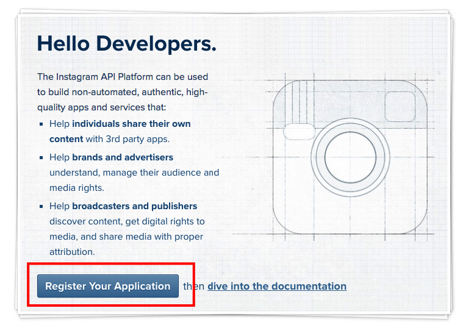
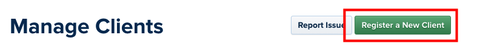
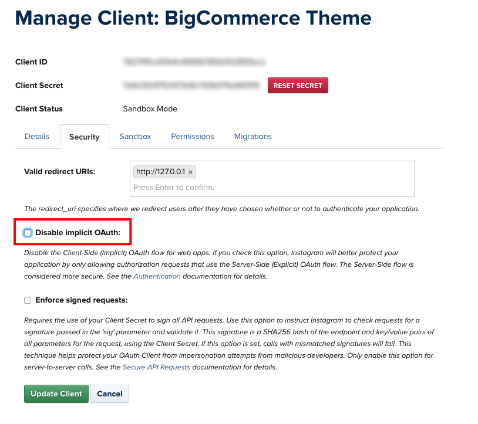
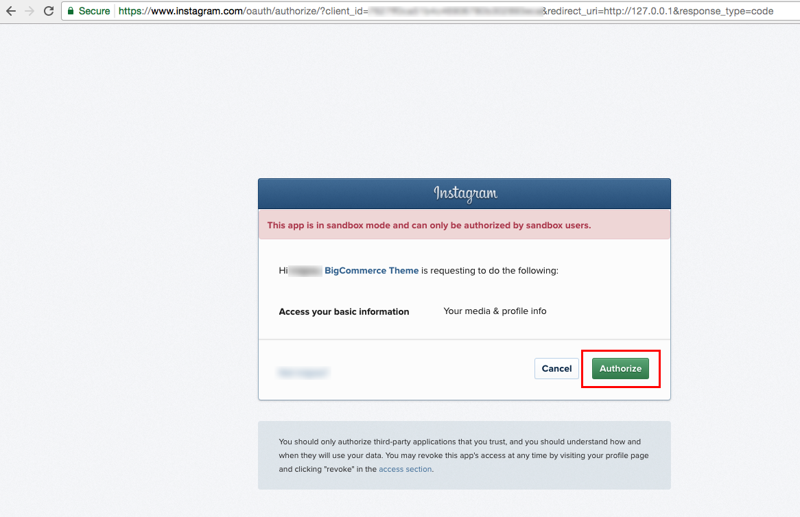
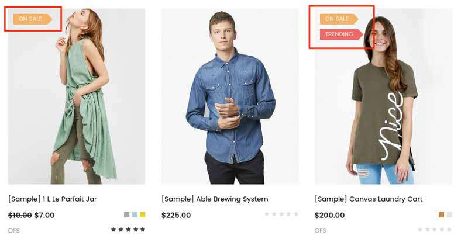

# Customization

This page will explain all configuration available and how to edit each section appear on theme. Let's view the first homepage.


## Top Banner


The top banner can be showed / edited in admin page > __Marketing__ > __Banners__. When you add / edit remember to choose __Location__ is __Top of Page__.

### Colors Customization

To customize colors of this section, go to admin page > __Storefront Design__ > __My Themes__, click button __Customize__ of the current theme to open the Theme Editor. 


Look into the options showing below:


## Header

### Header Styles
This theme support 3 different header styles:
- Logo at left
- Logo at right
- Logo at center


To configure, open the __Theme Editor__, scroll down to section __Logo__, click to expand the logo options. Choose a certain option of __Logo position__, then click __Refresh__ button appear after.


### User navigation Customization

To customize User navigation of the header section, look into the options showing below in the Theme Editor:


### Main navigation Customization

To customize Main navigation of the header section, look into the options showing below in the Theme Editor:


## Main Slideshow / Carousel

### Edit the slideshow

Edit the slideshow in admin page > __Storefront Design__ > __Design Options__:


### Change position of text content

The theme supports showing slideshow content like heading, text, button on __left__, __right__ or __center__ of the image. To configure this option, open Theme Editor, Look into section Carousel, click to expand:


Choose position of each slide you want to change.

### Colors Customization

To customize color of the slideshow's elements, look into section __Carousel__ in the Theme Editor:


### Hide the slideshow

To hide the slideshow on homepage, uncheck on the checkbox __Show Carousel__ in section __Carousel__ of the Theme Editor.

## Two Banner


To change the image url. Edit its values as you want.


## Products section 


To change the heading text, Columns number to show, Type, edit in The products section. Edit its values as you want.


## Recent Blog Posts


This block show the most recent blog posts.

### Customize heading text and other text

To change the heading text, read more text and date format, edit in The Blog section. Edit its values as you want.


## Instagram Photos


### Get your own User ID, Client ID, Access Token

In order to display your Instagram photos on your website, you will need to get the __User ID__, __Client ID__ and __Access Token__ from __Instagram Developer__ portal.

#### 1. Create your own Client ID

Open the URL <https://www.instagram.com/developer/> in your browser.

Login to your Instagram account.

Click button __Register Your Application__: 



Click button __Register a New Client__: 



Enter all required info on the form. 


Note that __Valid redirect URIs__ should be exactly `http://127.0.0.1` as recommended as it will be used in the next step.

After submitting the form you will get back to the previous page with a new __Client ID__ is created.


Save this __Client ID__ value, it will be used to configure the Instagram Photos block.

#### 2. Retrieve your Access Token

Click button __Manage__ on your the client app created previously. Open __Security__ tab, uncheck __Disable Implicit OAuth__ checkbox:



Click __Update Client__ button to complete.

Now open your web browser with the URL: 

```plain
https://api.instagram.com/oauth/authorize/?client_id=CLIENT-ID&redirect_uri=http://127.0.0.1&response_type=token
```

where `CLIENT-ID` is replaced by your __Client ID__ number created previously.

Click __Authorize__ button to grant access permission:



Instagram will redirect you to an error page with the URL similiar: 


The text after `access_token=` is the __Access Token__ you want to get. Save it for the next step.

#### 3. Retrieve your User ID

Open the link below on your web browser:

```plain
https://api.instagram.com/v1/users/self/?access_token=ACCESS-TOKEN
```
Where `ACCESS-TOKEN` is replaced by your real __Access Token__ just received previously.


The number in `"id": "..."` is your __User ID__.

### Display your Instagram photos

To display our own Instagram photos, in the Instagram section. input your real code:

- `access_token`: is your Instagram __Access Token__.


## Footer - Newsletter


### Change text

To change text appear on this section you can edit the language file as instruction below:

From admin page > __Storefront Design__ > __My Themes__, click button __Advanced__ > __Edit Theme Files__ of the current theme:


From the left navigation, click to edit the language file (e.i `en.json`):


See the section `Newsletter` you can edit as you want:


## Social Media Icons


You will need to configure which icons to appear in admin panel > __Storefront Design__ > __Design Options__, input your social links in __Social Media__ section.


## Payment Icons


To show/hide payment icons, go to Theme __Editor__ > __Payment Icons__ secitons, check or uncheck any icons you want to show or hide.

## Credit Links


To show/hide the credit links, go to Theme Editor > __Footer__ section, tick or untick the checkboxes as showing above.


## Assign different product layout to a specific product page

Theme has 2 product layouts: __default__ and __Fullwith with Lightbox__.

Product layout fullwidth:


To assign a product layout, edit your product in the admin panel. In tab __Order Details__, choose __Template Layout File__ with the layout out want:


## Assign different category layout to a specific category page

Theme has 2 category layout: __default__ and __Fullwidth__.

Category layout fullwidth:


To assign a category layout, edit your category in the admin panel. Choose __Template Layout File__ with the layout out want:


## Show custom product labels



Turn on displaying product labels in the __Theme Editor__ > __Products section__, tick on the checkbox __Show custom label using custom field 'card_label'__ and __choose Display Product Sale Badges__ as __Top Left__.


Edit your product in the admin panel to add custom label:


Add a custom label named `card_label` and enter label text in the value input box.

## Show color swatches on product card:


To display color watches on product card, open __Theme Editor__ > __Products section__, tick on the checkbox __Show color swatches using custom field 'card_color'__.


Edit your product in the admin panel to add custom label:


Add a custom label named `card_color` and enter color hex code in the value input box seperator by commas.

## Add our own CSS (Sass) code

To add your own custom CSS code you can edit the file `assets/scss/_theme-custom.scss_` in __Edit Theme Files__ editor:


__Note: __

- Copy / backup this file for future theme upgrade.
- Add custom CSS code required CSS (or Sass) programming skill. It's not recommended for new users.
