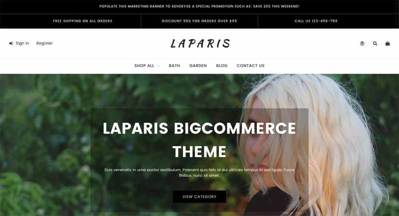
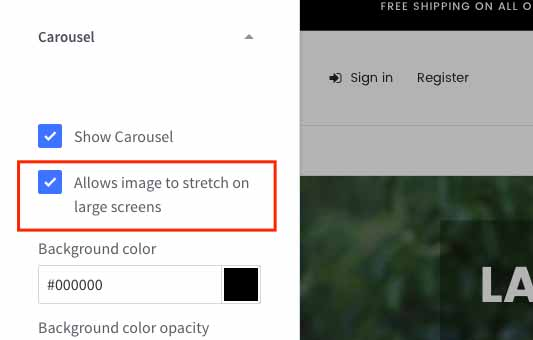
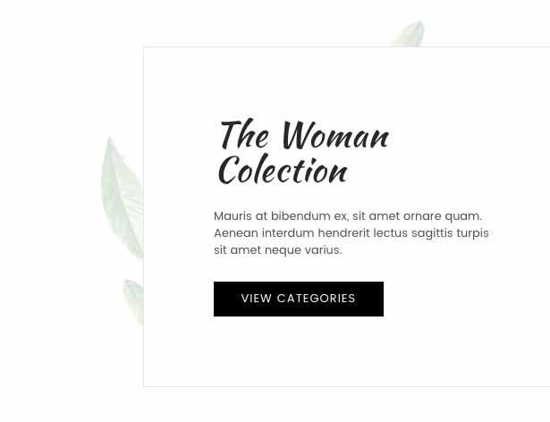

# FAQs

## How to make slideshow stretched full width?

 

Open __Theme Editor__ > __Carousel__ section > check to the option __Allows image to stretch on large screens__:




## How to remove the leaves background image on the first banner of 'Default' style?



To remove this leaves image, open __Edit Theme Files__, open file `assets/scss/_theme-custom.scss_`. Add the code below to the end of file:

```css
.emthemesModez-banner--laparis1:first-child .emthemesModez-banner-figcaption {
  background-image: none;
}
```

Save and refresh your homepage to see changes.